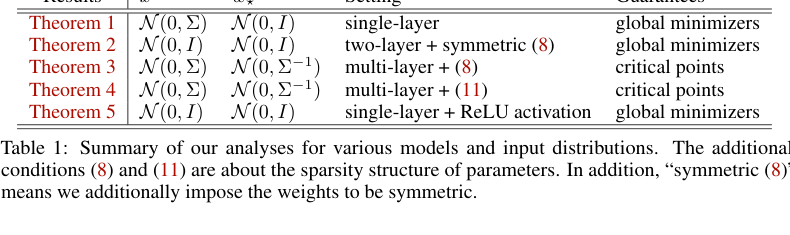
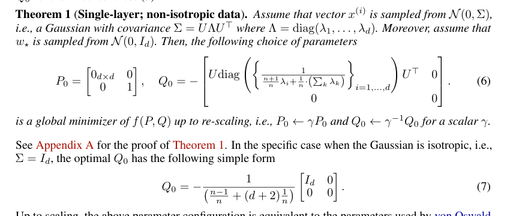
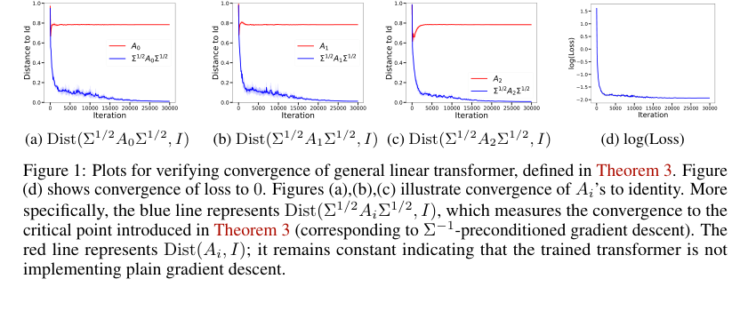
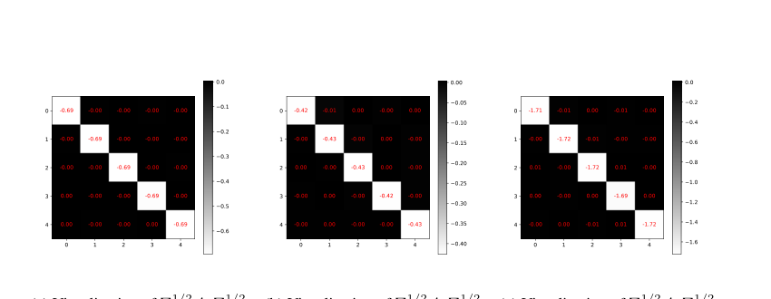
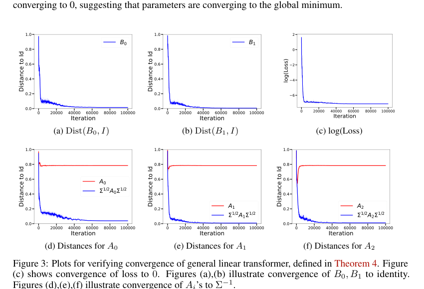
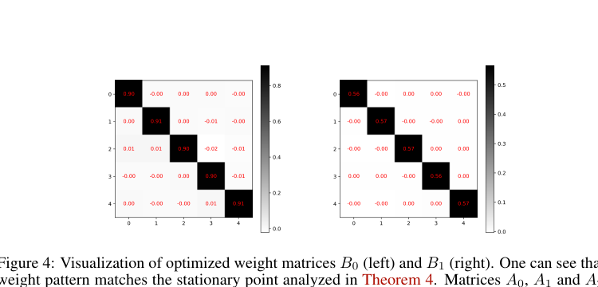

# Transformers learn to implement preconditioned gradient descent for in-context learning 文献分析与复现报告

> 论文：Kwangjun Ahn, Xiang Cheng, Hadi Daneshmand, Suvrit Sra. *Transformers learn to implement preconditioned gradient descent for in-context learning*. NeurIPS 2023.
>
> 公式说明：本文全部数学公式采用 Markdown 常见可渲染格式，行内公式使用 `$...$`，块级公式使用 `$$...$$`。
>
> 截图说明：本文截图均来自原论文 PDF。若单独移动本 Markdown 文件，请同时保留 `report_assets` 文件夹。

## 1. 摘要

这篇论文研究的问题是：Transformer 在 in-context learning 中表现出的“类学习算法”行为，是否只是表达能力上的人工构造，还是可以通过对随机任务实例的训练自然学到。作者将问题限制在线性回归任务上，使用去掉 softmax 的线性自注意力 Transformer，对训练目标的 loss landscape 进行理论分析。

论文的主要结论可以概括为三点。

1. 对单层线性注意力，作者完整刻画了训练目标的全局最优解，并证明全局最优参数实现了一步预条件梯度下降。
2. 对多层线性注意力，在特定稀疏参数约束下，Transformer 的前向传播等价于多步预条件梯度下降，且某些临界点对应 $A_\ell \propto \Sigma^{-1}$ 的协方差自适应预条件器。
3. 当放宽参数约束后，模型不只更新“预测权重”，还会变换输入特征，使 Gram 矩阵条件数改善，从而形成类似 GD++ 的机制。

这篇论文的理论价值在于，它把研究重心从“Transformer 是否有能力模拟某个算法”推进到“训练目标是否会把 Transformer 推向某类算法型参数”。从课程项目角度看，它明确涉及优化误差与计算复杂度方向，因为全文围绕 Transformer 如何学习并执行优化算法展开；同时，它也触及逼近误差方向，因为线性注意力层的表达结构被证明能实现特定优化迭代。

## 2. 论文基本信息与研究定位

### 2.1 论文信息

| 项目 | 内容 |
|---|---|
| 标题 | *Transformers learn to implement preconditioned gradient descent for in-context learning* |
| 作者 | Kwangjun Ahn, Xiang Cheng, Hadi Daneshmand, Suvrit Sra |
| 会议 | NeurIPS 2023 |
| 研究对象 | 线性自注意力 Transformer 在随机线性回归 ICL 任务上的训练景观 |
| 核心问题 | 训练 Transformer 是否会自然学到梯度下降类算法 |
| 主要理论工具 | 高斯分布矩计算、矩阵多项式展开、损失景观临界点分析 |
| 主要复现实验 | Theorem 3 与 Theorem 4 的临界点结构验证 |

### 2.2 相关工作脉络

这篇论文位于 in-context learning 机制解释的一条重要研究线中。Garg 等人的工作展示了 Transformer 可以从随机函数类中学会 ICL，其中线性函数是最基本的实验对象。Akyürek 等人进一步提出，线性模型上的 ICL 可以由经典学习算法解释，例如梯度下降、闭式最小二乘与岭回归。von Oswald 等人则给出更直接的构造性解释，即线性自注意力层可以实现梯度下降步骤。

Ahn 等人的推进点在于，他们不满足于证明“存在一组权重可以实现梯度下降”，而是分析训练目标自身的全局最优解与临界点结构。这个角度更接近深度学习理论中的优化景观分析，也更适合作为课程复现项目，因为它有明确的公式、实验曲线和结构性验证指标。

后续工作中，Zhang 等人研究了单层线性自注意力在梯度流下的收敛，Mahankali 等人进一步证明一层线性自注意力中一步梯度下降的最优性，Fu 等人则提出训练后的 Transformer 可能更像高阶优化方法。Shen 等人的 position paper 对“真实预训练 Transformer 是否通过梯度下降执行 ICL”提出了审慎态度。因此，本论文的结论应理解为合成线性回归设定下的严格机制分析，不能直接外推为所有大语言模型的完整解释。

## 3. 问题设定

### 3.1 随机线性回归任务

论文考虑随机线性回归实例。每个任务先采样真实参数 $w_\star \in \mathbb{R}^d$，再采样上下文样本 $x^{(i)} \in \mathbb{R}^d$。前 $n$ 个样本的标签由线性模型给出：

$$
y^{(i)} = \langle x^{(i)}, w_\star \rangle, \quad i = 1,2,\dots,n.
$$

第 $n+1$ 个样本是 query，其标签在 prompt 中被置为 $0$，模型需要根据上下文预测真实标签 $w_\star^\top x^{(n+1)}$。输入矩阵定义为：

$$
Z_0
=
\begin{bmatrix}
x^{(1)} & x^{(2)} & \cdots & x^{(n)} & x^{(n+1)} \\
y^{(1)} & y^{(2)} & \cdots & y^{(n)} & 0
\end{bmatrix}
\in \mathbb{R}^{(d+1) \times (n+1)}.
$$

这里，前 $d$ 行是特征，最后一行是标签。query 的标签为 $0$，用于防止标签泄露。

### 3.2 线性自注意力层

标准自注意力包含 softmax。论文为了得到可解析理论，采用去掉 softmax 的线性自注意力。先定义 mask 矩阵：

$$
M=
\begin{bmatrix}
I_n & 0 \\
0 & 0
\end{bmatrix}
\in \mathbb{R}^{(n+1)\times(n+1)}.
$$

该 mask 使 attention 只能使用前 $n$ 个有标签上下文样本，不能使用 query 的伪标签。

线性注意力层写为：

$$
\operatorname{Attn}_{P,Q}(Z)=PZM(Z^\top QZ),
$$

其中 $P,Q \in \mathbb{R}^{(d+1)\times(d+1)}$ 是可学习参数。

对于 $L$ 层 Transformer，递推为：

$$
Z_{\ell+1}
=
Z_\ell + \frac{1}{n}\operatorname{Attn}_{P_\ell,Q_\ell}(Z_\ell),
\quad \ell=0,1,\dots,L-1.
$$

模型输出定义为最终矩阵右下角元素的负值：

$$
\widehat{y}
=
\operatorname{TF}_L(Z_0;\{P_\ell,Q_\ell\}_{\ell=0}^{L-1})
=-[Z_L]_{d+1,n+1}.
$$

训练目标是 in-context 平方误差：

$$
f(\{P_\ell,Q_\ell\}_{\ell=0}^{L-1})
=
\mathbb{E}_{(Z_0,w_\star)}
\left[
\left(
\operatorname{TF}_L(Z_0;\{P_\ell,Q_\ell\}_{\ell=0}^{L-1})
+w_\star^\top x^{(n+1)}
\right)^2
\right].
$$

注意上式中出现加号，是因为模型预测值被定义为 $-[Z_L]_{d+1,n+1}$。若直接使用矩阵内部的右下角状态，则误差项就是 $[Z_L]_{d+1,n+1}+w_\star^\top x^{(n+1)}$。

## 4. 原论文结论总览

下图是原论文 Table 1 的截图，概括了不同设定下的理论结果。

| 结果 | 输入分布 | 权重分布 | 模型设定 | 理论保证 | 算法解释 |
|---|---|---|---|---|---|
| Theorem 1 | $x^{(i)}\sim\mathcal{N}(0,\Sigma)$ | $w_\star\sim\mathcal{N}(0,I)$ | 单层线性注意力 | 全局最优解 | 一步预条件梯度下降 |
| Theorem 2 | $x^{(i)}\sim\mathcal{N}(0,I)$ | $w_\star\sim\mathcal{N}(0,I)$ | 两层，稀疏且对称参数 | 全局最优解 | 两步坐标自适应梯度下降 |
| Theorem 3 | $x^{(i)}\sim\mathcal{N}(0,\Sigma)$ | $w_\star\sim\mathcal{N}(0,\Sigma^{-1})$ | 多层，稀疏参数 | 临界点 | $\Sigma^{-1}$ 预条件梯度下降 |
| Theorem 4 | $x^{(i)}\sim\mathcal{N}(0,\Sigma)$ | $w_\star\sim\mathcal{N}(0,\Sigma^{-1})$ | 多层，放宽参数 | 临界点 | 预条件梯度步加特征变换 |
| Theorem 5 | $x^{(i)}\sim\mathcal{N}(0,I)$ | $w_\star\sim\mathcal{N}(0,I)$ | 单层 ReLU 注意力 | 全局最优解 | 与线性注意力类似的一步更新 |

这个表说明，论文并没有对所有 Transformer 结构给出统一结论。它是在一组可解析设定中，逐步从单层全局最优推进到多层临界点结构。

## 5. 单层线性注意力的全局最优解

### 5.1 Theorem 1 的形式

Theorem 1 设定为：

$$
x^{(i)}\sim\mathcal{N}(0,\Sigma),
\quad
\Sigma=U\Lambda U^\top,
\quad
\Lambda=\operatorname{diag}(\lambda_1,\dots,\lambda_d),
\quad
w_\star\sim\mathcal{N}(0,I_d).
$$

原论文给出的单层全局最优解截图如下。

其核心公式可以写为：

$$
P_0^\star
=
\begin{bmatrix}
0_{d\times d} & 0 \\
0 & 1
\end{bmatrix},
$$

$$
Q_0^\star
=-
\begin{bmatrix}
U\operatorname{diag}\left(
\left\{
\frac{1}{\frac{n+1}{n}\lambda_i+\frac{1}{n}\sum_{k=1}^{d}\lambda_k}
\right\}_{i=1}^{d}
\right)U^\top & 0 \\
0 & 0
\end{bmatrix}.
$$

该解在重缩放意义下等价，即对任意非零标量 $\gamma$，可将 $P_0^\star$ 替换为 $\gamma P_0^\star$，将 $Q_0^\star$ 替换为 $\gamma^{-1}Q_0^\star$，注意力输出保持不变。

当 $\Sigma=I_d$ 时，$\lambda_i=1$，上式退化为：

$$
Q_0^\star
=-
\frac{n}{n+d+1}
\begin{bmatrix}
I_d & 0 \\
0 & 0
\end{bmatrix}.
$$

### 5.2 为什么这是预条件梯度下降

线性回归经验风险为：

$$
R_{w_\star}(w)
=
\frac{1}{2n}\sum_{i=1}^{n}
\left(w^\top x^{(i)}-w_\star^\top x^{(i)}\right)^2.
$$

其梯度为：

$$
\nabla R_{w_\star}(w)
=
\frac{1}{n}\sum_{i=1}^{n}
\left(w^\top x^{(i)}-w_\star^\top x^{(i)}\right)x^{(i)}.
$$

若从 $w_0=0$ 出发，一步预条件梯度下降为：

$$
w_1
=w_0-A\nabla R_{w_\star}(w_0)
=
\frac{1}{n}A\sum_{i=1}^{n}y^{(i)}x^{(i)}.
$$

当 $A$ 取为 Theorem 1 中由 $Q_0^\star$ 给出的矩阵时，Transformer 的 query 输出等价于：

$$
\widehat{y}
=\langle w_1,x^{(n+1)}\rangle.
$$

这说明单层线性注意力的全局最优参数并非一般意义上的任意线性预测器。它具有明确的算法结构，即执行一步带预条件矩阵的梯度下降。

### 5.3 预条件矩阵的统计含义

Theorem 1 中的预条件系数为：

$$
\alpha_i
=
\frac{1}{\frac{n+1}{n}\lambda_i+\frac{1}{n}\sum_{k=1}^{d}\lambda_k}.
$$

当 $n$ 较大时：

$$
\alpha_i \approx \frac{1}{\lambda_i}.
$$

因此 $Q_0^\star$ 的左上角块接近 $-\Sigma^{-1}$。这对应经典优化中的预条件思想：当输入协方差病态时，直接梯度下降会受到条件数影响，而使用 $\Sigma^{-1}$ 可显著改善收敛方向。

当 $n$ 较小时，分母中的项

$$
\frac{1}{n}\sum_{k=1}^{d}\lambda_k
$$

会变得重要。它类似一个由样本不足导致的自适应正则项。因此，论文的单层结论同时包含优化意义和统计意义：预条件器既适应输入协方差，也适应有限上下文样本引入的不确定性。

## 6. 多层稀疏参数：前向传播等价于多步预条件梯度下降

### 6.1 稀疏参数约束

论文第 4 节施加如下参数约束：

$$
P_i
=
\begin{bmatrix}
0_{d\times d} & 0 \\
0 & 1
\end{bmatrix},
\quad
Q_i
=-
\begin{bmatrix}
A_i & 0 \\
0 & 0
\end{bmatrix},
\quad
A_i\in\mathbb{R}^{d\times d}.
$$

这个结构强制 Transformer 每层只更新标签状态，不改变输入特征行。它使得模型前向传播可以严格解释为一组优化迭代。

### 6.2 Lemma 1：前向传播的优化解释

在上述参数约束下，Lemma 1 表明第 $\ell$ 层输出满足：

$$
[Z_\ell]_{d+1,n+1}
=-\langle x^{(n+1)},w_\ell^{\mathrm{gd}}\rangle,
$$

其中 $w_0^{\mathrm{gd}}=0$，并且：

$$
w_{\ell+1}^{\mathrm{gd}}
=
w_\ell^{\mathrm{gd}}-A_\ell\nabla R_{w_\star}(w_\ell^{\mathrm{gd}}).
$$

这就是多步预条件梯度下降。若 $A_\ell=\eta_\ell I$，则退化为普通梯度下降；若 $A_\ell$ 是更一般的矩阵，则是随层变化的预条件梯度下降。

这个引理是全文机制解释的核心。它说明在特定参数子空间中，Transformer 层数可以被理解为优化算法的迭代步数。

### 6.3 Theorem 2：两层各向同性情形

Theorem 2 研究两层 Transformer，在稀疏参数约束外再要求 $A_1,A_2$ 对称，并设：

$$
x^{(i)}\sim\mathcal{N}(0,I_d),
\quad
w_\star\sim\mathcal{N}(0,I_d).
$$

结论是存在对角矩阵 $A_1,A_2$ 构成全局最优解。结合 Lemma 1，这说明两层 Transformer 的最优行为是两步坐标自适应梯度下降。这里的“自适应”面向任务分布，对单个训练实例不采用 AdaGrad 那种动态累计历史梯度。

### 6.4 Theorem 3：多层非各向同性情形

Theorem 3 进一步设定：

$$
x^{(i)}\sim\mathcal{N}(0,\Sigma),
\quad
w_\star\sim\mathcal{N}(0,\Sigma^{-1}).
$$

定义集合：

$$
S=
\left\{
A:\ A_\ell=a_\ell\Sigma^{-1},\ \ell=0,1,\dots,L-1
\right\}.
$$

论文证明该集合本质上包含 in-context loss 的临界点，可概括为：

$$
\inf_{A\in S}
\sum_{\ell=0}^{L-1}
\left\|\nabla_{A_\ell}f(A)\right\|_F^2
=0.
$$

这里的含义是，存在一列满足 $A_\ell\propto\Sigma^{-1}$ 的参数，使梯度范数可以任意接近 $0$。由于论文也指出 infimum 可能不一定被取到，所以严格表述是“任意接近临界点”，而非必然存在一个精确梯度为零的点。

从优化角度看，经验风险 Hessian 为：

$$
\nabla^2 R_{w_\star}(w)
=
\frac{1}{n}XX^\top.
$$

当 $n$ 足够大时，$XX^\top/n$ 近似 $\Sigma$，所以 $\Sigma^{-1}$ 是自然的分布级预条件器。这解释了为什么 Theorem 3 中出现 $A_\ell\propto\Sigma^{-1}$。

## 7. 放宽参数约束：超出标准预条件梯度下降

第 5 节研究更宽松的参数形式：

$$
P_i
=
\begin{bmatrix}
B_i & 0 \\
0 & 1
\end{bmatrix},
\quad
Q_i
=
\begin{bmatrix}
A_i & 0 \\
0 & 0
\end{bmatrix},
\quad
A_i,B_i\in\mathbb{R}^{d\times d}.
$$

与第 4 节相比，这里 $B_i$ 允许模型直接变换特征矩阵。Theorem 4 设定同样是：

$$
x^{(i)}\sim\mathcal{N}(0,\Sigma),
\quad
w_\star\sim\mathcal{N}(0,\Sigma^{-1}).
$$

定义集合：

$$
S
=
\left\{
(A,B):\ A_\ell=a_\ell\Sigma^{-1},\ B_\ell=b_\ell I
\right\}.
$$

论文证明：

$$
\inf_{(A,B)\in S}
\sum_{\ell=0}^{L-1}
\left(
\left\|\nabla_{A_\ell}f(A,B)\right\|_F^2
+
\left\|\nabla_{B_\ell}f(A,B)\right\|_F^2
\right)
=0.
$$

在这个设定下，模型学习到的机制不再局限于对固定特征做梯度下降。特征行 $X_k$ 的更新近似为：

$$
X_{k+1}
=X_k+B_kX_kMX_k^\top A_kX_k.
$$

当 $A_k\propto\Sigma^{-1}$ 且 $B_k\propto I$ 时，这个更新既包含预条件梯度步，也包含对特征表示的线性变换。论文将其解释为一种曲率修正或条件数改善机制。在 $\Sigma=I$ 的特殊情形下，这与 von Oswald 等人观察到的 GD++ 机制相对应。

## 8. ReLU 注意力的单层结果

论文还研究了非线性注意力形式：

$$
\operatorname{Attn}_{P,Q}^{\sigma}(Z)
=PZM\sigma(Z^\top QZ),
$$

其中 $\sigma$ 按元素作用。对 ReLU 注意力，在 $x^{(i)}\sim\mathcal{N}(0,I_d)$、$w_\star\sim\mathcal{N}(0,I_d)$ 且 $Q_0$ 最后一行置零的条件下，Theorem 5 给出全局最优解：

$$
P_0^\star
=
\begin{bmatrix}
0_{d\times d} & 0 \\
0 & 1
\end{bmatrix},
$$

$$
Q_0^\star
=-
\frac{1}{\frac{1}{2}\frac{n-1}{n}+\frac{d+2}{n}}
\begin{bmatrix}
I_d & 0 \\
0 & 0
\end{bmatrix}.
$$

该结果说明在非常受限的单层各向同性情形中，ReLU 注意力的全局最优结构与线性注意力类似，只是系数不同。它并没有证明多层 softmax Transformer 会有相同结论。

## 9. 实验设置与结果分析

论文实验主要用于验证 Theorem 3 和 Theorem 4 的临界点结构。它没有像应用论文那样提供大规模 benchmark 表格，实验核心是观察训练后矩阵是否接近理论预测结构。

### 9.1 Theorem 3 验证实验

实验设定如下：

| 项目 | 设置 |
|---|---|
| 任务 | 线性回归 ICL |
| 维度 | $d=5$ |
| 上下文样本数 | $n=20$ |
| 输入分布 | $x^{(i)}\sim\mathcal{N}(0,\Sigma)$ |
| 权重分布 | $w_\star\sim\mathcal{N}(0,\Sigma^{-1})$ |
| 协方差 | $\Sigma=U^TDU$ |
| $D$ | 对角元素为 $(1,1,0.25,0.0625,1)$ |
| 模型 | 三层线性 Transformer，稀疏参数约束 |
| 优化器 | ADAM |
| batch size | 20000 |
| minibatch 重采样 | 每 100 步 |
| 梯度裁剪 | 每个矩阵裁剪到 0.01 |
| 重复次数 | 5 个不同随机 $U$ |

论文使用如下距离衡量矩阵是否接近单位阵的缩放：

$$
\operatorname{Dist}(M,I)
=
\min_\alpha \frac{\|M-\alpha I\|_F}{\|M\|_F}.
$$

Theorem 3 预测 $A_i\propto\Sigma^{-1}$，因此应观察到：

$$
\Sigma^{1/2}A_i\Sigma^{1/2}\propto I.
$$

原论文 Figure 1 截图如下。

图中蓝线表示 $\operatorname{Dist}(\Sigma^{1/2}A_i\Sigma^{1/2},I)$，红线表示 $\operatorname{Dist}(A_i,I)$。蓝线下降到接近 $0$，红线保持较高水平，说明训练结果接近 $\Sigma^{-1}$ 预条件器，而非普通梯度下降的 $I$ 方向。loss 曲线也下降到接近 $0$。

原论文 Figure 2 进一步给出训练结束后的矩阵热力图。

热力图中 $\Sigma^{1/2}A_i\Sigma^{1/2}$ 的对角结构非常明显，非对角元素接近 $0$，与 Theorem 3 的结构预测一致。

### 9.2 Theorem 4 验证实验

Theorem 4 的实验设定与 Theorem 3 类似，但上下文样本数改为 $n=10$，模型采用放宽参数约束，训练参数包括 $A_0,A_1,A_2,B_0,B_1$。原文指出目标函数不依赖 $B_2$。

需要注意，正文先写使用 ADAM 并沿用 Subsection 4.3 的设置，但在 Figure 3c 的文字中又写 loss 来自 L-BFGS iterations。这里存在优化器表述上的歧义。复现报告中应如实记录这一点，避免强行给出论文未明确统一的结论。

原论文 Figure 3 截图如下。

图中 $B_0,B_1$ 与单位阵的距离下降，说明 $B_i\propto I$；同时 $\Sigma^{1/2}A_i\Sigma^{1/2}$ 与单位阵的距离下降，说明 $A_i\propto\Sigma^{-1}$。这与 Theorem 4 的临界点结构一致。

原论文 Figure 4 展示了 $B_0,B_1$ 的热力图。

两个矩阵都接近缩放后的单位阵，说明放宽参数后，模型学习到的特征变换具有非常强的对角结构。

### 9.3 实验结果的解释

这些实验支持两个结论。

1. 在稀疏参数约束下，训练后的 $A_i$ 接近 $\Sigma^{-1}$ 预条件器，符合多步预条件梯度下降解释。
2. 在放宽参数约束下，训练后的 $A_i$ 与 $B_i$ 同时接近理论临界点结构，说明模型可以学习到超出标准预条件梯度下降的特征变换机制。

但也要注意，实验主要是结构验证。论文没有提供大量随机种子下的完整数值表，也没有给出所有关键超参数，尤其是部分学习率细节。因此复现时应以“曲线趋势”和“矩阵结构是否接近理论预测”为主要验收标准。

## 10. 面向课程复现的实现核对清单

你已经实现并运行代码，因此报告中更重要的是明确复现目标和验收标准。建议按如下顺序组织复现实验。

### 10.1 单层 sanity check

先跑 $L=1$、$\Sigma=I$ 的 case，检查学习到的 $Q_0$ 是否接近：

$$
Q_0^\star
=-\frac{n}{n+d+1}
\begin{bmatrix}
I_d & 0 \\
0 & 0
\end{bmatrix}.
$$

这个实验用于验证符号、mask、$1/n$ 缩放、query 标签置零是否正确。

### 10.2 非各向同性单层 case

设 $\Sigma=U\Lambda U^\top$，检查学习到的左上角块在 $U$ 的特征基下是否接近：

$$
-\operatorname{diag}\left(
\frac{1}{\frac{n+1}{n}\lambda_i+\frac{1}{n}\sum_{k=1}^{d}\lambda_k}
\right)_{i=1}^{d}.
$$

该实验用于验证 Theorem 1 的非各向同性预条件系数。

### 10.3 Theorem 3 复现

核心指标：

$$
\operatorname{Dist}(\Sigma^{1/2}A_i\Sigma^{1/2},I)
\downarrow 0,
$$

并且：

$$
\operatorname{Dist}(A_i,I)
$$

不应同步下降到 $0$。这说明模型学到的是 $\Sigma^{-1}$ 预条件器，而非普通梯度下降。

### 10.4 Theorem 4 复现

核心指标：

$$
\operatorname{Dist}(B_i,I)\downarrow 0,
$$

$$
\operatorname{Dist}(\Sigma^{1/2}A_i\Sigma^{1/2},I)\downarrow 0.
$$

同时观察是否满足论文中的经验现象：

$$
\|A_0\| \leq \|A_1\| \leq \|A_2\|.
$$

这表示模型在前面层使用较小步长，在后面层使用较大步长。论文解释为前面层的 $B_i$ 已经改善了特征矩阵条件数，后续层可以使用更激进的更新。

### 10.5 必须核对的工程细节

| 检查项 | 原论文对应点 | 复现时的风险 |
|---|---|---|
| query 标签置零 | $Z_0$ 最后一列最后一行为 $0$ | 若泄露真实标签，loss 会异常低 |
| 输出符号 | $\widehat{y}=-[Z_L]_{d+1,n+1}$ | 符号错会导致训练方向相反 |
| mask | $M=\begin{bmatrix}I_n&0\\0&0\end{bmatrix}$ | 若 query 参与上下文，会改变理论对象 |
| 缩放 | 每层有 $1/n$ | 缺失会改变最优系数与稳定性 |
| 稀疏约束 | Eq. (8) | Theorem 3 复现必须启用 |
| 放宽约束 | Eq. (11) | Theorem 4 复现必须允许 $B_i$ 学习 |
| 协方差 | $\Sigma=U^TDU$ | 需要确认代码里的 $D$ 表示协方差特征值还是标准差 |
| 优化器 | Theorem 4 存在 ADAM/L-BFGS 表述歧义 | 建议两者都记录，报告中如实说明 |

## 11. 批判性分析

### 11.1 论文贡献

第一，论文提供了单层线性注意力全局最优解的完整刻画。这个结果强于经验观察，因为它直接说明训练目标的最优解本身具有算法结构。

第二，论文把 Transformer 的层级前向传播与多步优化迭代联系起来。Lemma 1 的表达非常清晰，使得“层数对应优化步数”这一解释在特定参数子空间中成为严格命题。

第三，论文识别出 $\Sigma^{-1}$ 预条件器在训练景观中的重要性。这使得 Transformer 学到的算法不只是普通梯度下降，还能根据输入分布执行更高效的预条件更新。

第四，论文分析了放宽参数后的特征变换行为，说明模型可以学习超出传统梯度下降框架的机制。这对理解深层 Transformer 的算法表达能力有启发意义。

### 11.2 局限性

第一，理论设定高度理想化。输入是高斯线性回归任务，attention 去掉 softmax，模型是单头线性注意力。这与真实语言模型的训练分布和结构差距明显。

第二，多层结果主要是临界点结构，而非完整全局最优刻画。Theorem 3 和 Theorem 4 说明某些理论结构可以成为近临界点，但没有证明训练必然收敛到这些点。

第三，实验验证规模较小，主要依赖曲线和热力图。论文没有系统报告不同维度、不同条件数、不同随机种子、不同优化器下的完整统计表。

第四，Theorem 4 的实验优化器描述存在歧义。正文说使用 ADAM，但 Figure 3c 又写 L-BFGS iterations。复现时必须记录自己的优化器设置，不能将论文未统一说明的内容写成确定事实。

第五，该论文不能直接解释真实 LLM 的全部 ICL 行为。后续研究指出，真实预训练模型在示例顺序敏感性、输出分布变化等方面与显式梯度下降存在差异。因此，更合理的理解是：本文提供了一个严格、可复现、可分析的机制模型。

## 12. 与课程要求的对应关系

该论文符合“可学习性三大基础方向”中的至少两项。

### 12.1 优化误差与计算复杂度

论文核心研究 Transformer 是否能通过训练学会优化算法，尤其是预条件梯度下降。它分析的是训练目标的 loss landscape、全局最优解与临界点结构，直接属于优化理论方向。

### 12.2 逼近误差与表达能力

论文证明线性注意力层在特定参数化下可以实现梯度下降、预条件梯度下降以及带特征变换的算法。这说明 Transformer 架构具备表达某类优化过程的能力，属于表达能力分析。

### 12.3 与样本复杂度的关系

Theorem 1 中的预条件系数包含：

$$
\frac{1}{n}\sum_{k=1}^{d}\lambda_k.
$$

该项体现上下文样本数 $n$ 对最优预条件器的影响，可以被理解为有限样本下的统计修正。但整篇论文的主线并非样本复杂度分析，因此这部分只能作为辅助关联。

## 13. 可用于报告结论的总结

本文分析的论文从理论上说明，在随机线性回归 ICL 设定下，线性 Transformer 的训练目标会偏向具有明确算法结构的参数。单层情形下，全局最优解实现一步预条件梯度下降；多层稀疏参数情形下，前向传播等价于多步预条件梯度下降；进一步放宽参数后，模型还能通过特征变换改善条件数，形成类似 GD++ 的机制。

从复现角度看，最关键的结果并非单纯让 loss 下降，重点是验证训练后的矩阵结构是否符合理论预测。具体而言，Theorem 3 应观察到 $\Sigma^{1/2}A_i\Sigma^{1/2}$ 接近缩放单位阵，而 $A_i$ 本身不接近单位阵；Theorem 4 应进一步观察到 $B_i$ 接近缩放单位阵。只要这些结构性指标与论文图像趋势一致，就能较好地说明复现抓住了论文的核心机制。

总体而言，这篇论文适合作为深度学习理论复现项目，因为它理论目标明确、公式完整、实验规模可控，同时能够连接 Transformer、in-context learning、梯度下降、预条件优化和 loss landscape 等多个核心概念。

## 参考文献

Ahn, K., Cheng, X., Daneshmand, H., and Sra, S. Transformers learn to implement preconditioned gradient descent for in-context learning. Advances in Neural Information Processing Systems 36, 2023.

Ahn, K., Cheng, X., Song, M., Yun, C., Jadbabaie, A., and Sra, S. Linear attention is (maybe) all you need (to understand transformer optimization). arXiv preprint arXiv:2310.01082, 2023.

Akyürek, E., Schuurmans, D., Andreas, J., Ma, T., and Zhou, D. What learning algorithm is in-context learning? Investigations with linear models. International Conference on Learning Representations, 2023.

Brown, T. B., Mann, B., Ryder, N., Subbiah, M., Kaplan, J. D., Dhariwal, P., Neelakantan, A., Shyam, P., Sastry, G., Askell, A., Agarwal, S., Herbert-Voss, A., Krueger, G., Henighan, T., Child, R., Ramesh, A., Ziegler, D. M., Wu, J., Winter, C., Hesse, C., Chen, M., Sigler, E., Litwin, M., Gray, S., Chess, B., Clark, J., Berner, C., McCandlish, S., Radford, A., Sutskever, I., and Amodei, D. Language models are few-shot learners. Advances in Neural Information Processing Systems 33, 2020.

Duchi, J., Hazan, E., and Singer, Y. Adaptive subgradient methods for online learning and stochastic optimization. Journal of Machine Learning Research, 12:2121-2159, 2011.

Garg, S., Tsipras, D., Liang, P., and Valiant, G. What can transformers learn in-context? A case study of simple function classes. Advances in Neural Information Processing Systems 35, 2022.

Mahankali, A., Hashimoto, T. B., and Ma, T. One step of gradient descent is provably the optimal in-context learner with one layer of linear self-attention. arXiv preprint arXiv:2307.03576, 2023.

Schlag, I., Irie, K., and Schmidhuber, J. Linear transformers are secretly fast weight programmers. International Conference on Machine Learning, 2021.

Shen, L., Mishra, A., and Khashabi, D. Position: Do pretrained Transformers Learn In-Context by Gradient Descent? International Conference on Machine Learning, 2024.

Vaswani, A., Shazeer, N., Parmar, N., Uszkoreit, J., Jones, L., Gomez, A. N., Kaiser, L., and Polosukhin, I. Attention is all you need. Advances in Neural Information Processing Systems 30, 2017.

von Oswald, J., Niklasson, E., Randazzo, E., Sacramento, J., Mordvintsev, A., Zhmoginov, A., and Vladymyrov, M. Transformers learn in-context by gradient descent. International Conference on Machine Learning, 2023.

Wortsman, M., Lee, J., Gilmer, J., and Kornblith, S. Replacing softmax with ReLU in Vision Transformers. arXiv preprint arXiv:2309.08586, 2023.

Zhang, R., Frei, S., and Bartlett, P. L. Trained Transformers Learn Linear Models In-Context. Journal of Machine Learning Research, 25(49):1-55, 2024.
