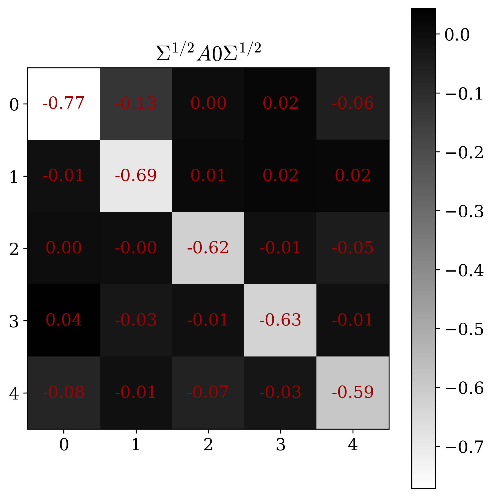
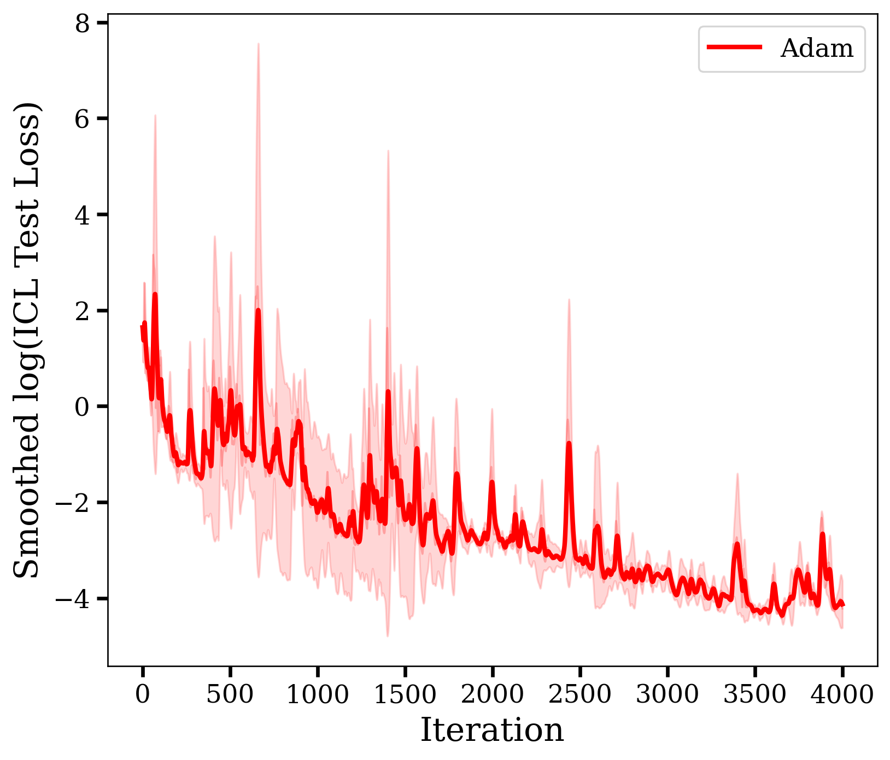
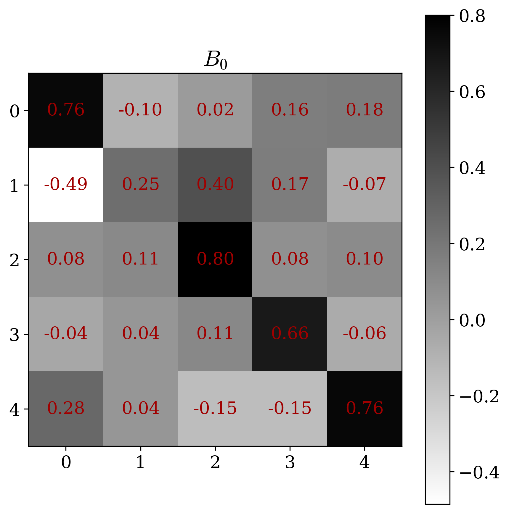

# 零基础成员理解指南：论文、实验与 PPT 设计思路

本文档面向尚未系统接触 Transformer、上下文学习或优化理论的成员。目标不是替代正式报告，而是帮助小组成员快速理解“这篇论文在问什么、为什么重要、我们的实验在验证什么、后续 PPT 和视频应该怎样讲”。

## 1. 一句话理解这篇论文

这篇 NeurIPS 2023 论文想回答一个问题：Transformer 在 prompt 里看到几个样例后做预测时，是否真的学会了一种类似梯度下降的学习算法，而不只是记住模式或靠人工构造的权重模拟算法。

更具体地说，论文把任务简化成线性回归。模型看到若干组输入和标签，再看到一个只有输入没有标签的 query，然后预测 query 的标签。作者证明并实验验证：在这种可分析的设定中，训练后的线性 Transformer 会表现得像在执行预条件梯度下降。

## 2. 先懂几个核心词

### Transformer

Transformer 是现在很多大模型的基础结构。它的核心组件是 attention。attention 可以理解成“当前 token 应该从前面哪些 token 里取信息，以及取多少”。在语言模型里，token 是文字；在这篇论文里，token 是线性回归样本。

### In-Context Learning

In-context learning，简称 ICL，意思是模型参数不更新，只靠 prompt 中的例子临时学会当前任务。

例如 prompt 给出：

- 样本 1：输入 $x_1$，标签 $y_1$
- 样本 2：输入 $x_2$，标签 $y_2$
- 样本 3：输入 $x_3$，标签 $y_3$
- 查询：输入 $x_q$，标签未知

模型需要根据前面样本推断规律，然后预测 $y_q$。这就像考试时先给几道例题，再给一道新题。

### 线性回归

线性回归假设标签由输入的线性组合产生：

$$
y = x^\top w_\star
$$

其中 $w_\star$ 是当前任务的真实参数。不同 prompt 对应不同的 $w_\star$，所以模型不能只记一个固定答案，而要从上下文样本里推断当前任务。

### 梯度下降

梯度下降是一种逐步降低损失的优化方法。可以把它理解为：先猜一个参数 $w$，计算当前错误方向，再沿着让错误变小的方向走一步。

普通梯度下降的形式是：

$$
w_{t+1}=w_t-\eta \nabla R(w_t)
$$

这里 $\eta$ 是步长，$\nabla R(w_t)$ 是损失函数的梯度。

### 预条件梯度下降

预条件梯度下降比普通梯度下降多了一个矩阵 $A$：

$$
w_{t+1}=w_t-A\nabla R(w_t)
$$

这个矩阵可以改变不同方向上的更新速度。如果数据在某些方向变化很大、某些方向变化很小，预条件器可以让优化过程更稳定、更有效。论文的关键结论之一是：Transformer 学到的不是普通梯度下降，而是带有协方差适应能力的预条件梯度下降。

## 3. 这篇论文为什么适合机器学习理论课程

这篇论文最匹配课程中的“优化误差 / 计算复杂度”方向。

原因是它把 Transformer 的前向传播解释成一个有限步优化过程。也就是说，模型的层数可以理解成优化迭代步数：一层像一步更新，多层像多步更新。因此问题变成：有限层 attention 可以多有效地降低线性回归任务的预测误差。

它也涉及两个辅助方向：

- 表达能力：线性 attention 是否能表达梯度下降类算法。
- 样本复杂度：prompt 中上下文样本数越多，模型对当前任务的估计通常越准。

## 4. 论文的核心设定

论文没有直接分析完整大语言模型，而是选择了一个更简单、更可证明的模型：线性 self-attention Transformer。

主要简化包括：

- 使用线性回归任务，而不是自然语言任务。
- 使用线性 attention，去掉 softmax，便于数学分析。
- 用 mask 限制 query 只能读取上下文样本信息。
- query 的标签位置设为 0，避免模型直接看到答案。

这类简化不是削弱论文意义，而是为了把 ICL 的算法机制从复杂系统中拆出来，单独分析。

## 5. Prompt 在论文里长什么样

在论文和报告中，prompt 被写成一个矩阵。前面列是上下文样本，最后一列是 query。

每个样本包含两部分：

- 输入向量 $x_i$
- 标签 $y_i$

query 也有输入 $x_q$，但它的标签位置被填成 0。模型经过多层 attention 后，从最后一列输出预测值。

PPT 中可以使用：

讲解时可以说：这张图的重点是“最后一个 label 被隐藏”，所以模型必须从前面的样本推断规律。

## 6. 论文理论机制如何理解

论文最重要的直觉是：attention 层不仅是在混合 token 信息，也可以被解释成一次优化更新。

对于线性回归，梯度下降需要用上下文样本计算梯度。线性 attention 正好可以把上下文样本的信息聚合起来。因此，某些 attention 权重会让模型的输出等价于：

$$
w_{\ell+1}=w_\ell-A_\ell\nabla R(w_\ell)
$$

这里 $\ell$ 可以理解为 Transformer 层数。于是，多层 Transformer 就像多步优化算法。

PPT 中可以使用：

讲解重点：

- 左边是 Transformer 层。
- 右边是优化迭代。
- 每一层都把预测往更低误差方向推进。

## 7. Theorem 1：单层为什么重要

Theorem 1 说明，在单层设定下，训练目标的全局最优解对应一步预条件梯度下降。

零基础理解版本：

- 模型只有一层时，只能做一次信息聚合。
- 作者证明，最优的信息聚合方式不是随便凑出来的，而是等价于一次带预条件器的梯度下降。
- 这说明预条件梯度下降不是人为解释，而是训练目标自然偏好的结构。

PPT 中可以用 `figures/pse_theorem1_formula.png` 展示核心公式，但不要在视频里展开所有推导。

## 8. Theorem 3：稀疏约束下的多步预条件梯度下降

Theorem 3 研究多层模型，但给参数加了一个稀疏结构限制。这个限制让模型更容易被解释：每层主要负责做一次预条件梯度更新。

核心判断标准是看矩阵：

$$
\Sigma^{1/2}A_i\Sigma^{1/2}
$$

如果它接近单位阵，就说明 $A_i$ 接近 $\Sigma^{-1}$，也就是模型学到了适应数据协方差的预条件器。

零基础理解版本：

- 数据在不同方向上难度不同。
- 好的优化器会根据方向调整更新。
- Theorem 3 说，在这个设定下，多层 Transformer 每层都会学到这种方向调整。

PPT 中可以使用：

## 9. Theorem 4：放宽约束后模型还能做什么

Theorem 4 放宽了参数约束。此时模型不只可以做预条件梯度下降，还可能学习一种特征变换。

可以把它理解成两条路线：

- $A_i$ 路线：负责像预条件梯度下降一样更新预测。
- $B_i$ 路线：负责改变输入特征的表示，使后续优化更容易。

零基础理解版本：

- Theorem 3 像是在固定坐标系里优化。
- Theorem 4 允许模型先把坐标系变得更适合优化。
- 这更接近深度模型中“表示学习 + 优化”的组合。

PPT 中可以使用：

## 10. 我们的实验到底在复现什么

报告中使用两个简称：

- PSE：Paper-scale Structural Evidence，指原论文官方规模下的结构性证据。
- CRE：Course-scale Reproduction Evidence，指本项目课程规模下的小规模复现和扩展证据。

不要把 CRE 说成“完全复刻原论文全部数值”。更准确的说法是：CRE 检查同一套理论结构是否能在课程规模实验中呈现一致趋势。

我们的实验重点不是只看 loss，而是看结构是否接近理论预测。

## 11. 实验图应该怎么看

### Loss 曲线

Loss 曲线下降，说明模型预测误差变小。但 loss 本身不能完全说明模型用了什么机制。

讲解时可以说：loss 下降是必要现象，但不是最关键证据。

### Distance 曲线

Distance 曲线衡量学到的矩阵离理论目标有多远。

如果 rotated distance 下降，说明学到的矩阵越来越接近预条件器结构。这比单纯 loss 更能说明机制。

### Heatmap 热力图

热力图展示矩阵元素。理论上，旋转后的矩阵应该接近 identity-like，也就是对角线明显、非对角元素较小。

讲解时可以说：热力图不是为了看颜色好不好看，而是为了看矩阵结构是否符合理论。

## 12. Theorem 3 的 CRE 结果怎么讲

使用图片：

讲解逻辑：

1. Loss 随训练下降，说明模型确实学到有效预测。
2. Rotated distance 下降，说明学到的 $A_i$ 朝 $\Sigma^{-1}$ 方向移动。
3. 热力图呈现近似对角结构，说明矩阵结构与 PSE 中的理论判断一致。

一句话结论：CRE 支持 Theorem 3 的核心机制，即稀疏约束多层 Transformer 可以表现为多步预条件梯度下降。

## 13. Theorem 4 的 CRE 结果怎么讲

使用图片：

讲解逻辑：

1. Loss 下降说明放宽设置下模型仍能学习。
2. $A_i$ 相关距离朝理论方向变化，说明预条件更新仍然存在。
3. $B_i$ 热力图体现了特征变换路径的结构信号。

一句话结论：Theorem 4 说明 Transformer 不只会做优化步，还可能学习让优化更容易的特征表示。

## 14. 上下文长度扩展实验怎么讲

扩展实验改变 prompt 中上下文样本数 $N$，比较 Transformer、GD、PGD、OLS 的测试损失。

使用图片：

主要结论：

- 当上下文样本更多时，模型通常获得更多任务信息。
- OLS 在样本足够时通常更强，因为它直接求解线性回归。
- PGD 往往比普通 GD 更稳定，因为预条件器能缓解协方差带来的方向不均衡。
- 图中 $N=12$ 附近的突刺主要出现在普通 GD 曲线，可解释为有限步数、固定步长和非各向同性协方差共同造成的数值敏感现象。它不是论文主结论的反例，反而能帮助说明预条件方法为什么更稳定。

## 15. PPT 讲述主线建议

建议全组统一使用以下主线：

1. 这篇论文研究 Transformer 的 ICL 机制。
2. 它不是只问模型能不能模拟梯度下降，而是问训练后是否自然学到梯度下降类算法。
3. 在线性回归和线性 attention 设定下，作者证明模型会实现预条件梯度下降。
4. PSE 是原论文的结构性证据，CRE 是我们的课程规模复现证据。
5. CRE 中的 loss、distance 和 heatmap 与理论趋势一致。
6. 上下文长度扩展实验补充了样本复杂度视角。

## 16. 建议分工

可以按四位成员分为四个部分，每个人负责 4 到 6 页 PPT 或对应讲稿。

| 成员 | 建议负责内容 | 核心图片 |
|---|---|---|
| Duan Yixuan | 选题背景、ICL、课程方向匹配 | `linear_regerssion_structure.png` |
| Mingjing XING | 理论机制、Theorem 1、Theorem 3 | `theoretical_mechanism.png`、`theorem_3 sparse_setting _mechanism.png` |
| Wenyue Yang | Theorem 4、PSE 与 CRE 主要结果 | `theorem4_Relaxed_setting_and_feature_transformation.png`、CRE 曲线 |
| Jingwen Luo | 扩展实验、局限、总结与视频串联 | `cre_variable_n_smooth.png`、`summary.png` |

分工可以调整，但建议保证每个人都能回答一个问题：这一部分如何支持“Transformer 学到优化算法”这个总观点。

## 17. 零基础讲解时避免的误区

- 不要把 Transformer 说成“真的像人一样学习”。更准确地说，它在该数学设定下实现了类似优化算法的计算结构。
- 不要说 CRE 完全复现了原论文全部数值。应说 CRE 复现了核心结构趋势。
- 不要只展示 loss。结构距离和热力图才是机制证据。
- 不要把线性 attention 的结论直接推广到所有大语言模型。它是一个可分析模型，为理解真实模型提供线索。
- 不要在 PPT 里堆太多公式。每页最多保留一个核心公式，并配一句直观解释。

## 18. 后续延展和思考

### 延展 1：从线性 attention 到 softmax attention

真实 Transformer 通常使用 softmax attention。后续可以思考：如果加入 softmax，预条件梯度下降结构是否仍然存在？它会不会变成更复杂的非线性优化过程？

### 延展 2：从线性回归到更复杂任务

线性回归便于证明，但真实 ICL 任务更复杂。可以进一步研究分类、非线性函数、稀疏回归或多任务混合分布。

### 延展 3：从固定步数到自适应计算

论文中层数对应固定优化步数。真实模型可能根据输入难度呈现不同程度的计算。后续可以思考如何让模型动态决定“需要几步推理”。

### 延展 4：从单一指标到机制证据链

复现实验说明，只看准确率或 loss 不够。更完整的机制研究需要同时看：

- 预测性能
- 参数矩阵结构
- 与理论目标的距离
- 不同任务规模下的稳定性

## 19. 视频录制建议

15 分钟视频可以按以下时间分配：

| 时间 | 内容 |
|---|---|
| 0:00-1:30 | 论文背景与核心问题 |
| 1:30-3:30 | ICL 和线性回归 prompt |
| 3:30-6:30 | 预条件梯度下降机制 |
| 6:30-9:30 | Theorem 3 与 CRE 复现 |
| 9:30-12:00 | Theorem 4 与 CRE 复现 |
| 12:00-13:30 | 上下文长度扩展 |
| 13:30-15:00 | 局限、延展和总结 |

讲稿风格建议：

- 每页先说结论，再解释图。
- 遇到公式先讲直觉，再讲符号。
- 实验页统一回答三个问题：图上看什么、趋势是什么、它支持什么理论结论。

## 20. 最终总结

这篇论文的核心价值在于，它把 Transformer 的上下文学习从“神秘的 prompt 能力”转化为一个可分析的优化过程。在随机线性回归和线性 attention 设定中，训练后的模型会呈现预条件梯度下降结构。我们的 CRE 实验在课程规模下复现了关键趋势，并通过上下文长度实验补充了样本复杂度视角。

PPT 和视频应围绕一句主线展开：Transformer 的 in-context learning 可以被理解为一种学习到的优化算法，而预条件梯度下降是这篇论文给出的核心机制解释。
