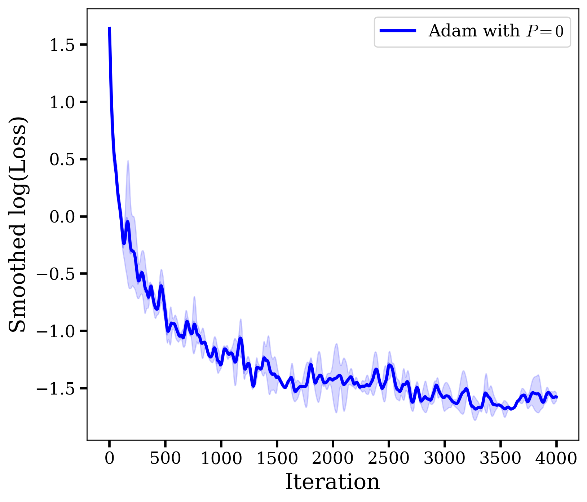
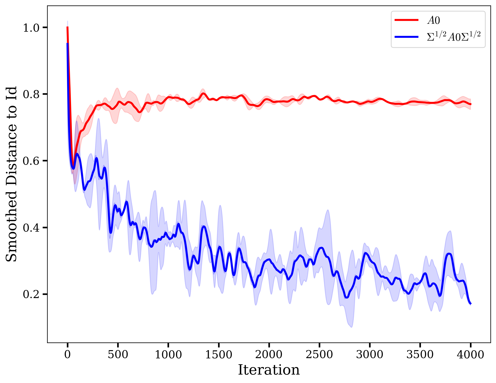
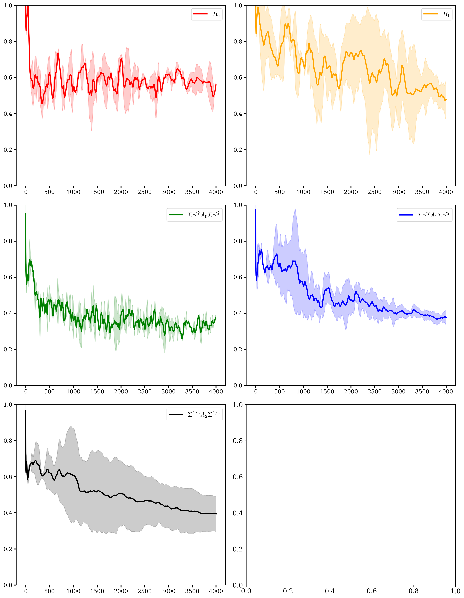
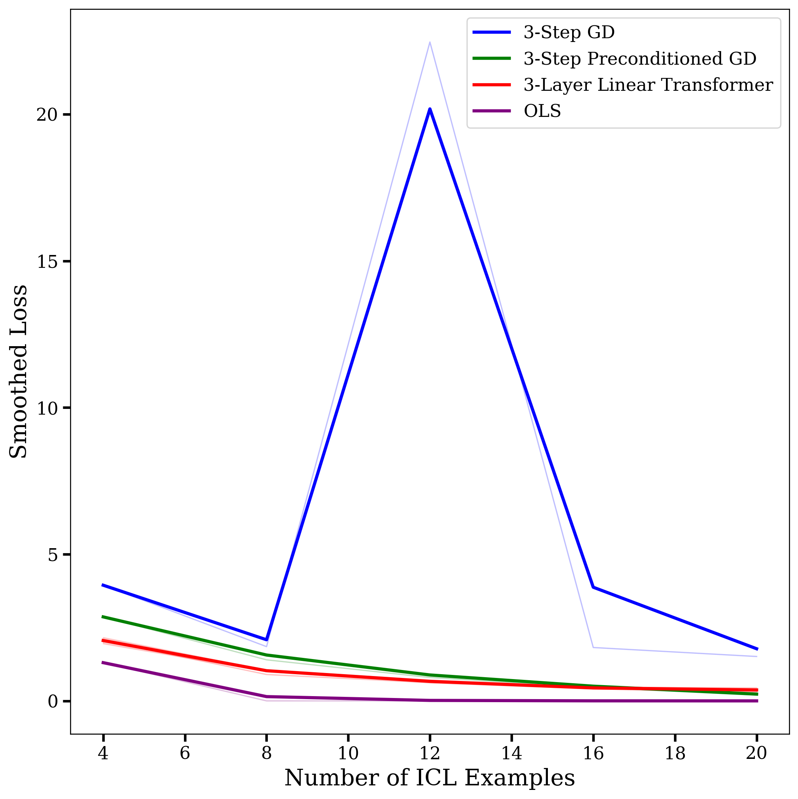
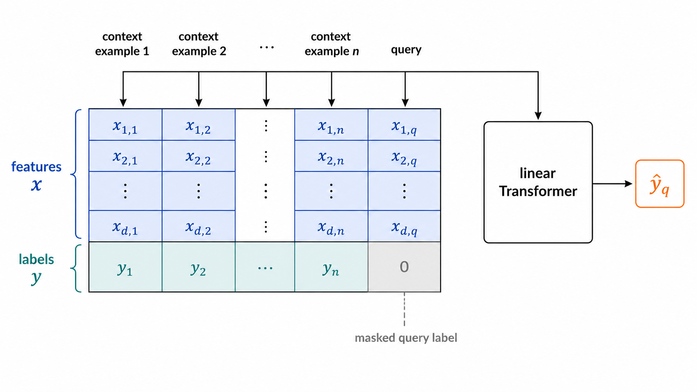
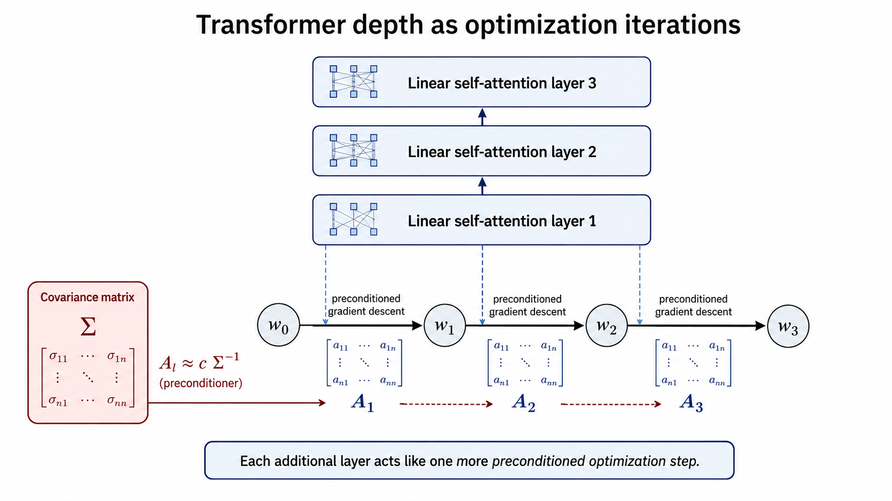
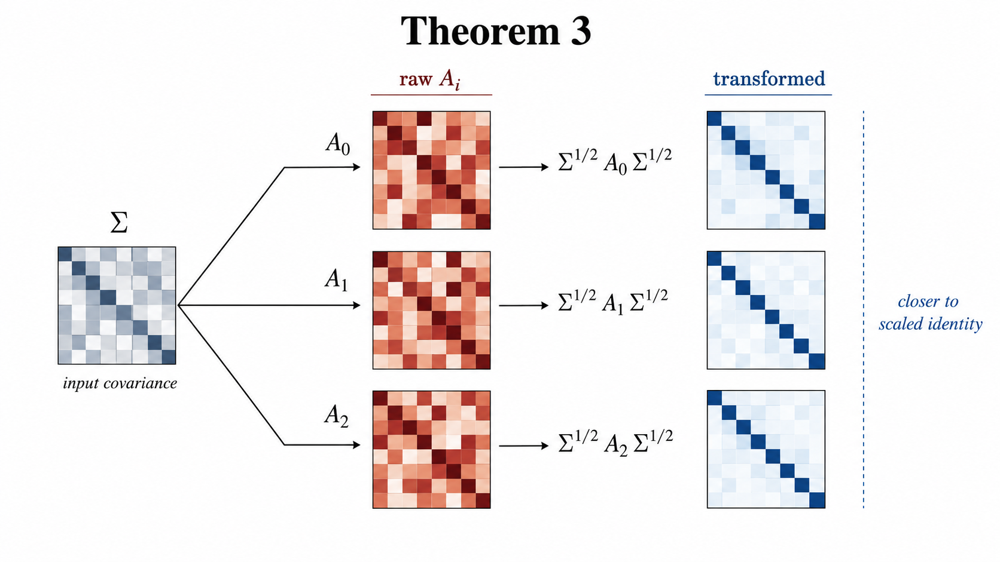
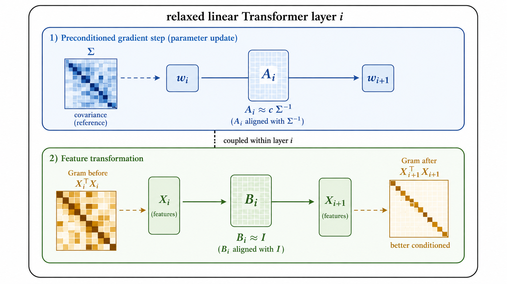
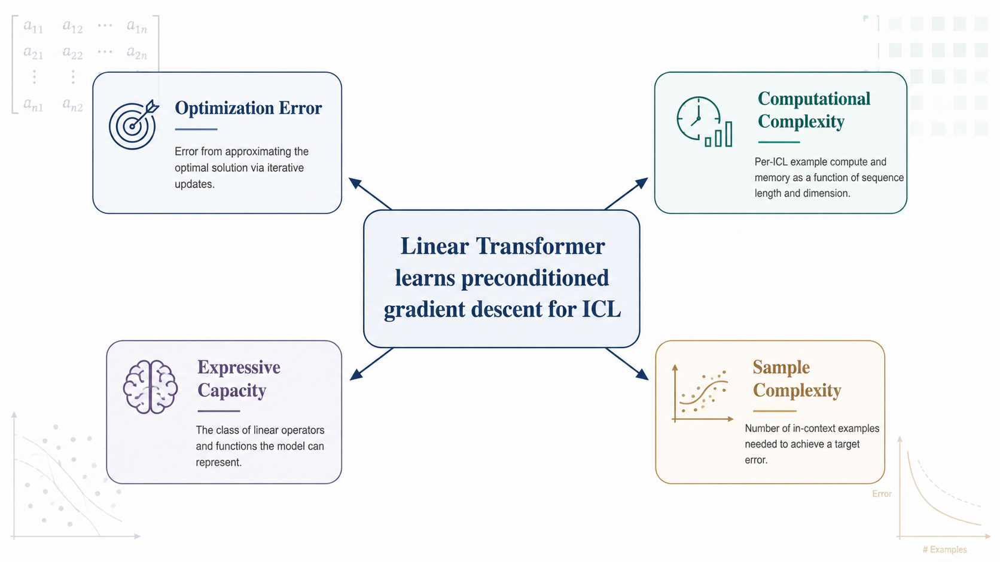

# PPT 设计思路：Transformer 如何学会预条件梯度下降

## 设计定位

- **主题**：复现 NeurIPS 2023 论文 *Transformers learn to implement preconditioned gradient descent for in-context learning*。
- **课程主线**：优化误差 / 计算复杂度；辅助解释表达能力；用上下文长度扩展实验补充样本复杂度视角。
- **讲述目标**：在 15 分钟内解释论文问题、理论机制、复现实验、结果对比和扩展思考。
- **视觉风格**：学术会议汇报风，白底，深蓝 + 青绿 + 琥珀色强调；避免花哨渐变和装饰性图形。
- **术语约定**：原论文实验称为 **Paper-scale Structural Evidence (PSE)**；本项目复现实验称为 **Course-scale Reproduction Evidence (CRE)**。

## 可用图片清单

以下图片均已放入 `ppt-design/figures`，后续可直接交给 PPT 生成流程使用。

| 图片 | 用途 |
|---|---|
| `figures/pse_table1_summary.png` | 论文理论结果总览 |
| `figures/pse_theorem1_formula.png` | Theorem 1 单层全局最优公式 |
| `figures/pse_theorem3_curves.png` | Theorem 3 原论文曲线 |
| `figures/pse_theorem3_heatmaps.png` | Theorem 3 原论文热力图 |
| `figures/pse_theorem4_curves.png` | Theorem 4 原论文曲线 |
| `figures/pse_theorem4_b_heatmaps.png` | Theorem 4 原论文 B 矩阵热力图 |
| `figures/cre_t3_loss_smooth.png` | CRE Theorem 3 loss 曲线 |
| `figures/cre_t3_a0_distance_smooth.png` | CRE Theorem 3 A0 distance 曲线 |
| `figures/cre_t3_a0_heatmap.png` | CRE Theorem 3 A0 热力图 |
| `figures/cre_t4_loss_smooth.png` | CRE Theorem 4 loss 曲线 |
| `figures/cre_t4_distance_panel.png` | CRE Theorem 4 distance panel |
| `figures/cre_t4_b0_heatmap.png` | CRE Theorem 4 B0 热力图 |
| `figures/cre_variable_n_smooth.png` | 上下文长度扩展实验 |
| `figures/linear_regerssion_structure.png` | AI 生成：线性回归 prompt 结构图 |
| `figures/theoretical_mechanism.png` | AI 生成：Transformer 层作为预条件 GD 迭代 |
| `figures/theorem_3 sparse_setting _mechanism.png` | AI 生成：Theorem 3 稀疏设置机制图 |
| `figures/theorem4_Relaxed_setting_and_feature_transformation.png` | AI 生成：Theorem 4 放宽设置与特征变换图 |
| `figures/summary.png` | AI 生成：课程主题总结图 |

## 关键图片预览

### PSE 理论结果总览

### CRE Theorem 3 复现实验

### CRE Theorem 4 复现实验

### 上下文长度扩展实验

### AI 生成概念图：Prompt 结构

### AI 生成概念图：理论机制

### AI 生成概念图：Theorem 3 机制

### AI 生成概念图：Theorem 4 机制

### AI 生成概念图：总结框架

## 20 页页面规划

### 1. 标题页

- 标题：Transformer 如何学会预条件梯度下降？
- 副标题：NeurIPS 2023 论文复现与课程规模结构验证
- 信息：SDSC6001 Machine Learning；Duan Yixuan、Mingjing XING、Wenyue Yang、Jingwen Luo；日期
- 视觉：简洁标题 + 线性 Transformer / 优化迭代概念背景图

### 2. 选题与课程方向匹配

- 说明论文发表于 NeurIPS 2023。
- 主方向：优化误差 / 计算复杂度。
- 辅助方向：表达能力、样本复杂度。
- 视觉：四节点关系图，中心是 ICL as learned optimization。

### 3. 核心问题

- 问题不是“Transformer 能否被构造为梯度下降”。
- 核心是“训练后是否自然学到梯度下降类算法”。
- 视觉：左侧 manual construction，右侧 training-induced algorithm。

### 4. 背景：In-Context Learning

- Prompt 中有上下文样本和 query。
- 模型参数不更新，但输出应适应当前任务。
- 视觉：context examples 到 query prediction 的流程图。

### 5. 线性回归 Prompt 设定

- 展示 $Z_0$ 矩阵结构。
- 强调 query label 置零，防止标签泄露。
- 图片：`figures/linear_regerssion_structure.png`
- 视觉：矩阵形式 prompt，最后一列标签为 0。

### 6. 线性 Self-Attention

- attention 去掉 softmax，便于理论分析。
- mask 只允许使用前 $n$ 个上下文样本。
- 视觉：mask 矩阵 + attention block。

### 7. Theorem 1：单层全局最优

- 单层全局最优实现一步预条件 GD。
- 预条件器适应输入协方差。
- 图片：`figures/pse_theorem1_formula.png`

### 8. 多层机制：层数对应优化步数

- 每一层对应一次 $w_{\ell+1}=w_\ell-A_\ell\nabla R(w_\ell)$。
- Transformer depth 变成 optimization iterations。
- 图片：`figures/theoretical_mechanism.png`
- 视觉：3 层 Transformer 与 3 步 PGD 对齐。

### 9. Theorem 3：稀疏约束结构

- $A_i \propto \Sigma^{-1}$。
- 检查 $\Sigma^{1/2}A_i\Sigma^{1/2}$ 是否接近单位阵。
- 图片：`figures/theorem_3 sparse_setting _mechanism.png`
- 视觉：raw A vs rotated A 对比。

### 10. PSE：Theorem 3 官方结构证据

- 图片：`figures/pse_theorem3_curves.png`
- 讲述蓝线下降、红线不等同下降的含义。
- 结论：学到的是预条件器，不是普通 GD。

### 11. CRE：Theorem 3 复现曲线

- 图片：`figures/cre_t3_loss_smooth.png`、`figures/cre_t3_a0_distance_smooth.png`
- 讲述 loss 下降、rotated distance 明显下降。
- 强调 CRE 是课程规模结构验证。

### 12. CRE：Theorem 3 热力图

- 图片：`figures/cre_t3_a0_heatmap.png`
- 说明旋转后的矩阵呈现近似对角 / identity-like 结构。

### 13. Theorem 4：放宽参数后的新机制

- 不只更新预测权重，还变换输入特征。
- $A_i$ 做预条件梯度步，$B_i$ 做特征变换。
- 图片：`figures/theorem4_Relaxed_setting_and_feature_transformation.png`
- 视觉：A path + B path 双通道结构图。

### 14. PSE：Theorem 4 官方证据

- 图片：`figures/pse_theorem4_curves.png`、`figures/pse_theorem4_b_heatmaps.png`
- 讲述 $B_i$ 接近单位阵，$A_i$ 接近 $\Sigma^{-1}$ 结构。

### 15. CRE：Theorem 4 复现结果

- 图片：`figures/cre_t4_loss_smooth.png`、`figures/cre_t4_distance_panel.png`
- 讲述 loss 与结构距离均朝理论方向变化。

### 16. CRE：Theorem 4 热力图

- 图片：`figures/cre_t4_b0_heatmap.png`
- 说明 feature transformation 的结构信号。

### 17. 扩展实验：上下文长度 N

- 图片：`figures/cre_variable_n_smooth.png`
- 展示 Transformer、GD、PGD、OLS 随 N 变化的测试损失。
- 解释为样本复杂度 / 估计误差视角。
- 明确说明 N=12 附近的突刺主要来自普通 GD 曲线，解释为非各向同性协方差下有限步固定步长 GD 的数值敏感性；PGD 更平稳，支持预条件稳定优化的结论。

### 18. 综合对比：PSE vs CRE

- 左列 PSE，右列 CRE。
- PSE 是 paper-scale 官方证据，CRE 是课程规模复现证据。
- 共同结论：结构趋势与理论解释一致。

### 19. 局限与拓展

- 线性 attention，不等同于所有 LLM。
- 高斯线性回归设定较理想化。
- 未来方向：softmax attention、多临界点、更多任务分布。

### 20. 结论页

- Transformer 的 attention 层可以被解释为学习到的优化步骤。
- 预条件器连接优化误差与计算复杂度。
- CRE 支持论文核心结构结论。
- 结束语：ICL can be studied as learned optimization。
- 图片：`figures/summary.png`

## 交给 PPT-Agent 的设计要求

- 页面比例：16:9。
- 每页信息密度中等，优先图 + 结论句。
- 公式页只保留 1 个核心公式，不堆叠推导。
- 所有实验页必须清楚标记 PSE 或 CRE。
- 不出现硬件环境描述；CRE 统一表述为 course-scale / small-scale reproduction。
- 图片优先使用现有 `figures` 资源；概念图可参考 `docs/recording/image_gen.md` 的 prompt 生成。
